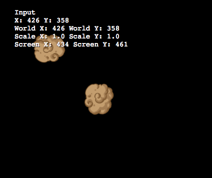

# pilasengine.js

Un experimento que busca crear un motor de juegos compatible con pilas-engine, pero con la posibilidad de editar el código en tiempo real y revertir cambios.



## Instalación

Primero tienes que tener instalado grunt-cli:

```
sudo npm install -g grunt-cli
pip install bumpversion
```

Y luego, clonar el repositorio y ejecutar el siguiente comando:

```
make iniciar
```

## Comandos principales

El comando make va a mostrar todas las opciones disponibles:

```
make
```
